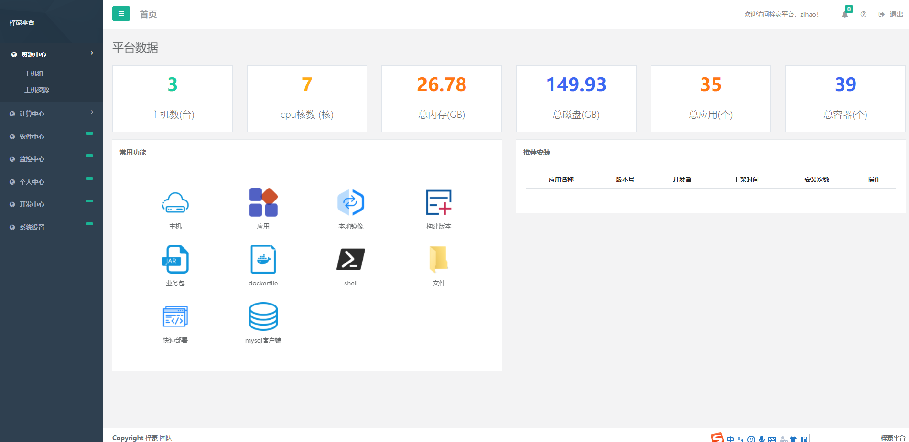
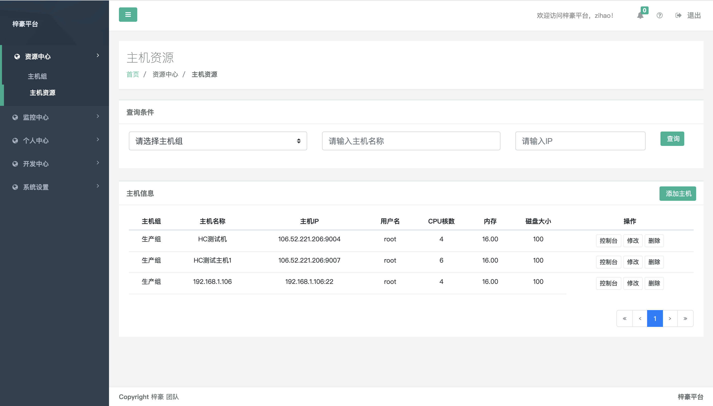
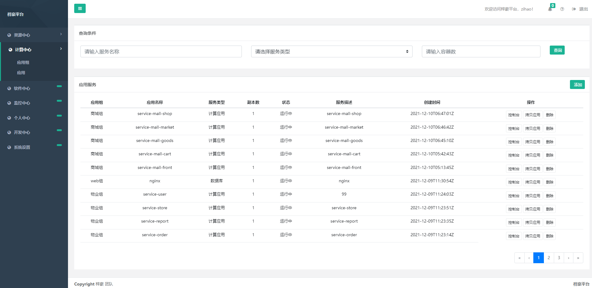
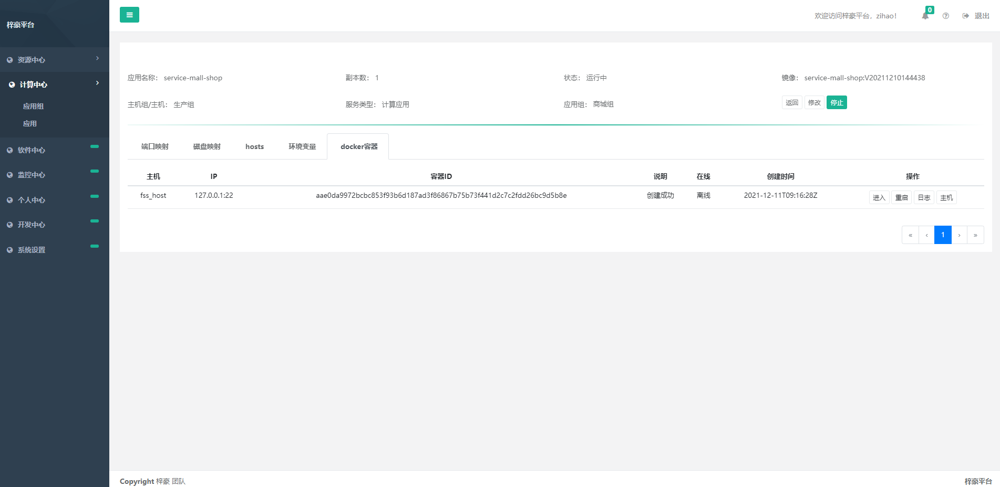
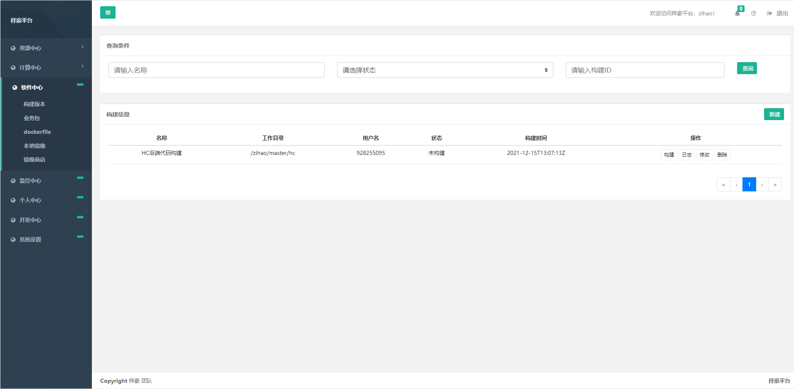
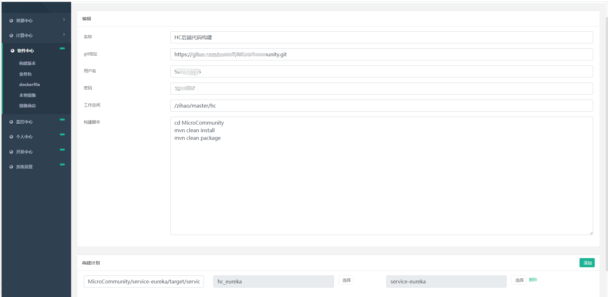
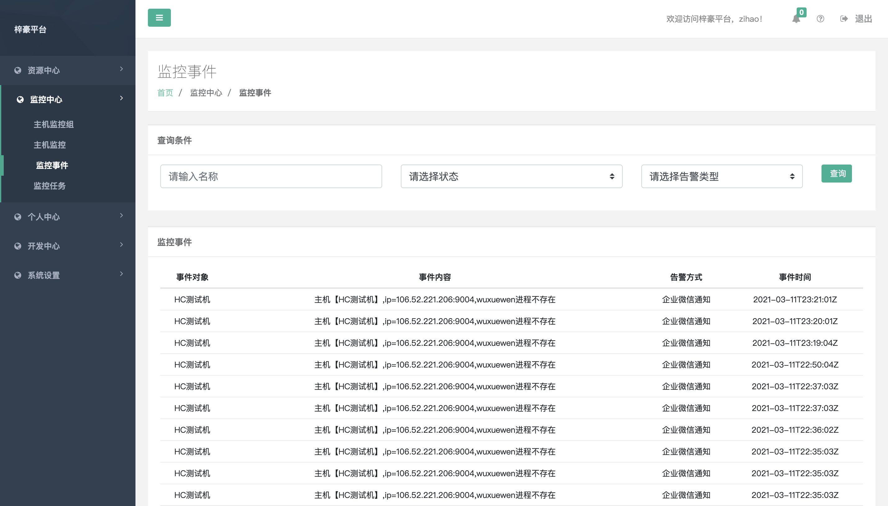
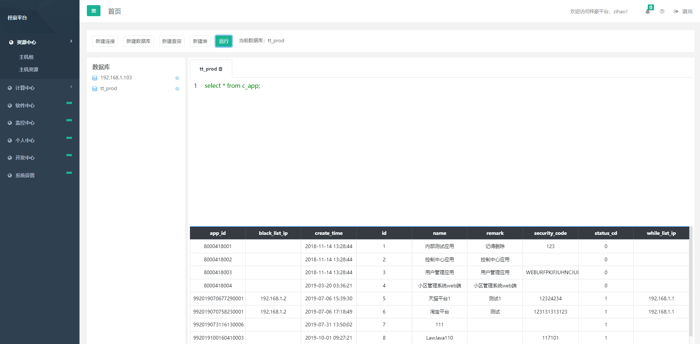

## 梓豪平台是一个docker 容器化管理平台 包括主机管理，手工制作镜像，镜像管理，ci/cd 构建和应用管理的paas平台。欢迎安装使用，也欢迎贡献！

## qq:709574906

### 1.0 安装(install)

yum install -y wget && wget https://homecommunity.oss-cn-beijing.aliyuncs.com/install.sh && sh install.sh

或者

yum install -y wget && wget https://homecommunity.oss-cn-beijing.aliyuncs.com/install.sh -O zihaoinstall.sh && sh zihaoinstall.sh

### 2.0 如何访问（view）

访问地址 http://ip:7000
账号为 zihao 
密码为 123456

### 3.0 演示地址(demo)

http://www.zihao.org.cn/  账号 zihao 密码 123456

### 4.0 视频教程（video）

https://www.bilibili.com/video/BV1BM4y1w7Ti?spm_id_from=333.999.0.0

### 5.0 文档

[梓豪相关文档](https://github.com/zihao-boy/zihao/wiki)

### 6.0 功能列表
 
 1、多租户管理：在系统设置下添加不同的租户 权限分离，更加有利于不同团队管理不同的项目，相互不受影响;

 2、多主机管理: 局域网多主机管理，包括linux 和window （window需要安装 openssh）,包括各个主机中启动的容器，主机资源使用情况等；

 3、web shell功能：web端集成shell 和cmd 操作能力 可以远程 操作服务器，不用再单独安装 shell客户端工具；

 4、文件系统：让linux 系统就像window一样 界面化操作文件夹和文件，文件上传，下载，新建 ，编辑，删除，重名等功能呢；

 5、应用管理：依赖强大的docker 容器能力，用镜像的方式交付，让管理docker容器更加方便，支持多主机 容器化部署，底层依赖k8s 等组件管理容器，
端口映射，磁盘映射，hosts,环境变量 界面化操作，简单方便不易出错；

 6、ci/cd 持续集成功能：简化开发到项目部署的难度，通过webhook 等方式 开发者推代码后触发项目的编译 构建镜像，推镜像并发布到应用，通过企业
微信或者钉钉机器人的方式通知整个过程中的消息；

 7、docker 镜像管理：镜像交付让运维的同事不再那么关注环境的差异而带来的各种问题，让升级回退扩容变的简单

 8、mysql web 操作控制：我们将mysql 客户端在 web端实现，方便运维的同事登录梓豪平台即可操作数据库，避免设置复杂的网络等，也是为了将数据库
端口对外不开放来提高数据库的安全性

 9、 数据备份功能 分为文件 和数据库备份 可以备份到 ftp oss 和mysql 数据库

 10、实现ftp 客户端功能 文件操作包括上传下载 删除 重命名等

 11、实现oss 客户端功能 文件操作包括上传下载 删除 等

未来我们还会加入很多有趣的功能。

### 7.0 系统截图

